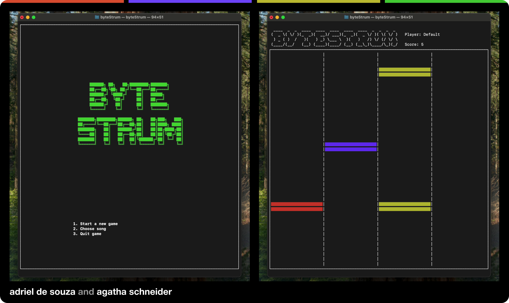

# 🎸 byteStrum

**Guitar Hero in the macOS Terminal!**



> Inspired by [rational-kunal/SSSnake](https://github.com/rational-kunal/SSSnake)

Created by [Agatha Schneider](https://github.com/htaschne) and [Adriel de Souza](https://github.com/htaschne)

---

## 🧠 About

**byteStrum** is a minimalist rhythm game that brings the excitement of Guitar Hero to your macOS Terminal. It's a Swift-based project that utilizes `AVFoundation` to play `.midi` files, allowing users to simulate playing songs directly from the command line.

---

## 🚀 Features

- 🎶 Play `.midi` songs directly in the Terminal
- 🕹️ Simulate guitar strumming with keyboard inputs
- 📂 Simple file-based song selection
- 🧪 Lightweight and easy to run

---

## 📦 Installation

1. **Clone the repository:**

   ```bash
   git clone https://github.com/htaschne/byteStrum.git
   cd byteStrum
   ```

2. **Open the project in Xcode:**

   ```bash
   open byteStrum.xcodeproj
   ```

3. **Build and run the project:**

    - Ensure you have a song file (e.g., `song.midi`) placed in the `songs` directory.
    - Modify the `main.swift` file to point to your project folder:

    ```swift
    let basePath = "/Users/your-username/GitHub/byteStrum/"
    ```
- Build and run the project in Xcode.

   - Run the project in Xcode.

---

## 🎮 How to Play
- Launch the game from the Terminal.
- Follow the on-screen prompts to select and play a song.
- Use your keyboard to simulate guitar strumming in sync with the music by pressing `A`, `S`, `D`, or `F` when the notes reach the bottom.

